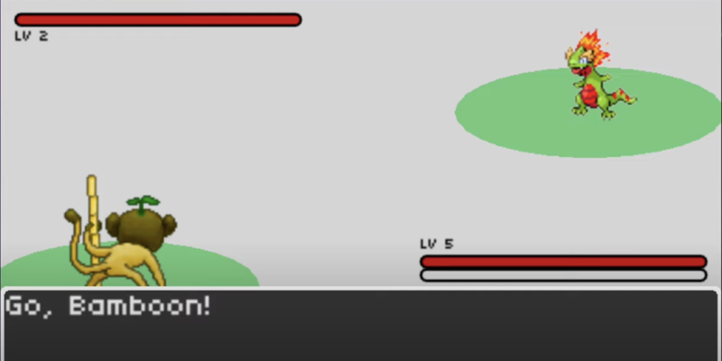

# Pokémon

A turn-based battle system inspired by the classic Pokémon games, built with LÖVE2D for CS50's Game Development course.



## Description

This project simulates a Pokémon-style battle system, featuring turn-based combat, animated menus, stat-based damage, and type-themed monsters. It includes a world map, battle encounters, and custom UI inspired by the original GBA games.

Features include:

- Turn-based combat system with health, attack, experience, and leveling
- Player and opponent Pokémon with unique stats and animations
- Battle menus, attack choices, and visual effects
- World exploration with random encounters
- Dynamic textboxes and GUI transitions

## How to Play

### Controls

- `Arrow Keys`: Navigate menus and move player  
- `Enter`: Confirm selections / interact  
- `Backspace`: Cancel / go back  

### Objective

Explore the map and win turn-based battles against opposing Pokémon using your team's attacks and tactics.

## Development

### Built With

- [LÖVE2D](https://love2d.org/) — 2D game framework  
- Lua — Programming language  
- Custom GUI, state stack system, and battle engine  
- Sprite-based animation and map tiles

### Project Structure

- `main.lua` — Game entry point  
- `src/` — Game states, entities, battle system, and world logic  
- `graphics/` — Pokémon sprites, tilesheets, and UI elements  
- `sounds/` — SFX and music for field and battle modes  
- `lib/` — Helper libraries (`knife`, `push`, `class`, etc.)  
- `fonts/` — UI text assets

## Installation and Running

1. [Download and install LÖVE2D](https://love2d.org/)
2. Clone the repository:
   ```bash
   git clone https://github.com/ethanperello/pokemon.git
   ```
3. Run the game:
   ```bash
   love pokemon
   ```

## Demo

[Watch the gameplay demo](https://www.youtube.com/watch?v=vpGzT32EYfo&t=15s)

## Credits

- Developed by Ethan Perello  
- Created as part of CS50's Game Development course  
- Pokémon sprites inspired by fan-made monsters from various GBA-style projects  
- GUI assets and sounds sourced from open game art and Kenney.nl
